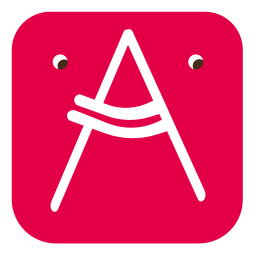
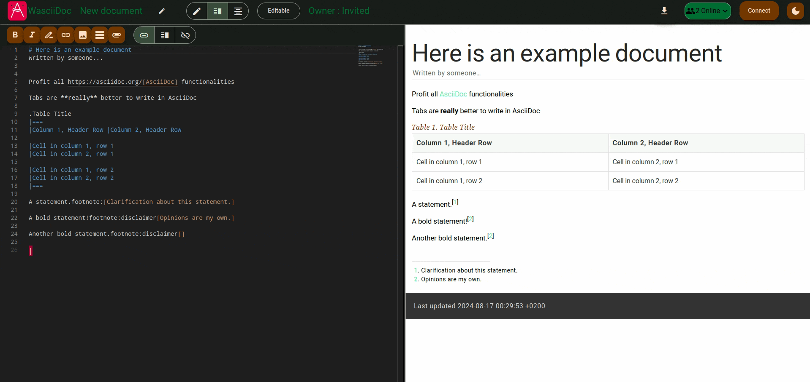

# WasciiDoc

Simple web tool to write documents using [Asciidoc](https://asciidoc.org/), 
inspired by the great project [Hedgedoc](https://github.com/hedgedoc/hedgedoc).

## Getting started

- Try out a [demo instance](https://app.wasciidoc.com/) to get discover the project
  - You will have to login to Github to edit documents
- Then [setup your own instance using Docker](docs/deploy_with_docker.md)
- To enable authentication, follow [this guide](docs/setup_oauth.md)

## Features

- Collaborative editing 🃏 
- Permissions by document 🔒
- PDF / HTML export 🌿
- OAuth (Gitlab / Github) 🦣
- Dark / light theme 🌙
- On reflexion : 
  - Folder management
  - Multi-owner documents
  - More authentication methods (open to requests)
  - Support for Aadoc headers

## Project status

The project is just starting, report any question / issue / proposition on the Github
issues page.

## Development

Based on Angular as frontend and Python in the backend, we 
want to have a flexible architecture.
See [DEVELOPMENT.md](docs/DEVELOPMENT.md) for more information.
